 

# Previsão de Série Temporal — Temperaturas mínimas diárias (Melbourne, 1981–1990)

Este repositório contém um estudo de previsão de séries temporais usando **Prophet**, **LSTM** e baselines em uma série diária de temperaturas mínimas (°C) de Melbourne (1981–1990).

- **Dataset (Kaggle):** `daily-minimum-temperatures-in-me.csv`  
  https://www.kaggle.com/datasets/shenba/time-series-datasets/data?select=daily-minimum-temperatures-in-me.csv  
  (variações equivalentes: https://www.kaggle.com/datasets/suprematism/daily-minimum-temperatures)  

> O notebook inclui EDA, validação com origem rolante e comparação entre modelos, além de gráficos e tabelas de diagnóstico.

---

## 🔁 Pipeline resumido

1. **Carregamento e limpeza**  
   - Conversão de datas e alvo para tipos numéricos; ordenação por data; frequência diária com `asfreq("D")` e interpolação curta.  

2. **EDA**  
   - Visão da série completa; média mensal agregada; decomposição STL (tendência/sazonalidade) e ACF/PACF.  

3. **Divisão temporal**  
   - **Treino:** até 1989-12-31; **Teste (hold-out):** 1990 (365 dias).  
   - Baselines: Naive-1 e Seasonal-Naive (m=365).  

4. **Modelos**
   - **Prophet** (aditivo; sazonalidade anual; *tuning* leve em `changepoint_prior_scale` e `seasonality_prior_scale`). :contentReference[oaicite:0]{index=0}  
   - **LSTM** (janela 14×1; escalonamento `MinMaxScaler`; *early stopping*). :contentReference[oaicite:1]{index=1}  
   - **SARIMAX + Fourier** (opcional): sazonalidade longa m=365 via termos de Fourier como regressoras exógenas, com ARIMA capturando dinâmica de curto prazo. :contentReference[oaicite:2]{index=2}

5. **Validação**  
   - **Cross-validation com origem rolante**: 3 dobras, horizonte H=60.  

6. **Métricas**  
   - **RMSE** e **MAE** (unidades em °C) e **MASE** (erros escalados por um *naïve*/diferenciação m=365). **MAE** é robusta a outliers; **RMSE** penaliza desvios grandes; **MASE** permite comparação justa entre modelos e séries. Evitamos **MAPE** pois a série chega perto de 0°C. :contentReference[oaicite:3]{index=3}

---

## ✅ Resultados principais (hold-out 1990)

> Valores obtidos com a execução padrão do notebook (podem variar ± por diferenças de ambiente/seed).

| Modelo          | RMSE | MAE  | MASE |
|-----------------|-----:|-----:|-----:|
| **LSTM**        | **2.268** | **1.755** | **0.561** |
| **Prophet (best)** | 2.509 | 1.930 | 0.617 |
| Seasonal-Naive  | 3.651 | 2.867 | 0.917 |

**Ganho relativo vs Seasonal-Naive**  
- LSTM: **~38%** melhor em RMSE; **~39%** em MAE.  
- Prophet: **~31%** melhor em RMSE; **~33%** em MAE.

**Cross-validation (origem rolante; H=60, 3 dobras — médias):**

| Modelo | RMSE_mean | MAE_mean | MASE_mean |
|-------|----------:|---------:|----------:|
| Prophet | 2.579 | 1.961 | 0.632 |
| LSTM    | **2.368** | **1.857** | **0.599** |

---

## 🖼️ Figuras

> As imagens abaixo cobrem EDA, ajuste dos modelos, comparação e diagnósticos. Todas as escalas de valores estão em **°C**.

### Série e EDA

* **Série completa**
  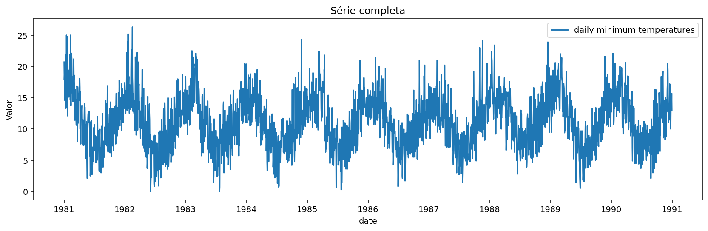
  **O que é:** a série diária de temperaturas mínimas (1981–1990) já regularizada para frequência “D” e com pequenos buracos interpolados.
  **Como ler:** oscilações de curto prazo (dias) sobrepostas a um padrão anual bem marcado.
  **O que observar:** picos e vales recorrentes em janelas ~365 dias → forte sazonalidade anual; nível médio estável (sem “drifts” longos), favorável a modelos com sazonalidade explícita (Prophet/SARIMAX+Fourier) e a janelamento curto para LSTM.

* **Média mensal agregada**
  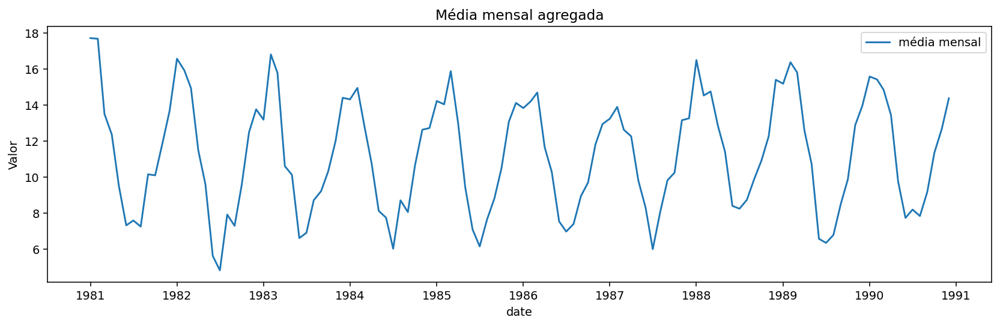
  **O que é:** a série agregada para médias mensais, preservando a forma sazonal.
  **Como ler:** linha mais suave elimina ruído diário e destaca a sazonalidade; meses de inverno/verão ficam evidentes.
  **O que observar:** o “desenho” se repete ano a ano, justificando sazonalidade **anual** nos modelos.

* **ACF & PACF (60 lags)**
  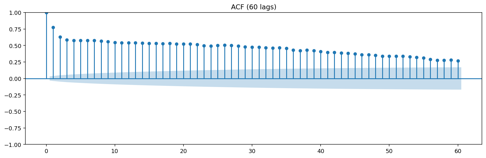
  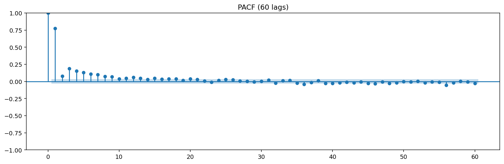
  **O que é:** autocorrelação (ACF) e autocorrelação parcial (PACF) até 60 defasagens.
  **Como ler:** barras acima das bandas de confiança indicam dependências temporais relevantes.
  **O que observar:** padrões ondulados e significativos em defasagens relacionadas à sazonalidade; a presença de correlação residual sugere incluir termos sazonais (Fourier) ou componentes sazonais explícitos.

* **STL — tendência e sazonalidade**
  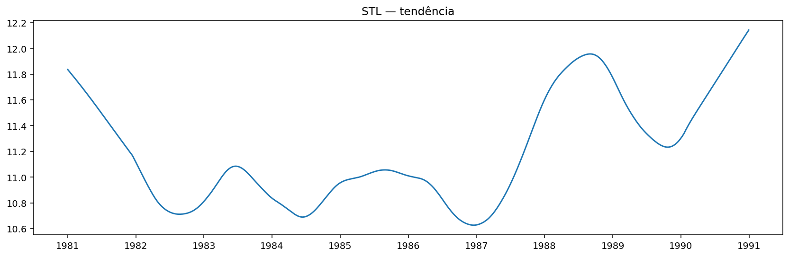
  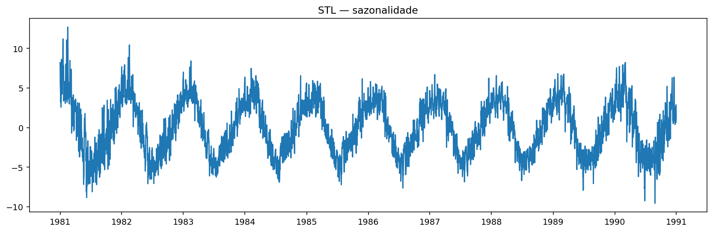
  **O que é:** decomposição da série em **tendência** e **componente sazonal** (periodicidade 365).
  **Como ler:** tendência quase horizontal (estabilidade do nível) + sazonalidade anual bem definida.
  **O que observar:** reforça a decisão de modelagem aditiva com sazonalidade anual (Prophet) e o uso de Fourier em SARIMAX.

---

### Modelos e comparações

* **Baselines no teste**
  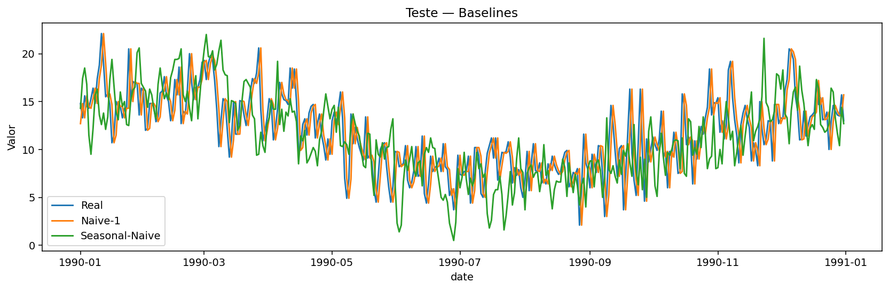
  **O que é:** comparação entre o **Naive-1** (repete o último valor) e o **Seasonal-Naive** (repete a última temporada de 365 dias) versus o valor real.
  **Como ler:** servem de “piso” de desempenho; qualquer modelo útil deve superá-los.
  **O que observar:** nossa comparação final mostra Prophet e LSTM superando especialmente o Seasonal-Naive, validando que os modelos aprenderam algo além do padrão trivial.

* **Prophet vs Real**
  
  **O que é:** predições do melhor Prophet (com *tuning* leve) no período de teste.
  **Como ler:** linha prevista segue a forma sazonal do real; pequenas discrepâncias em mudanças bruscas (dias atípicos) são esperadas em modelos aditivos suaves.
  **O que observar:** boa aderência de fase sazonal; erros maiores tendem a ocorrer em picos/vales muito agudos (penalizados por RMSE).

* **LSTM vs Real**
  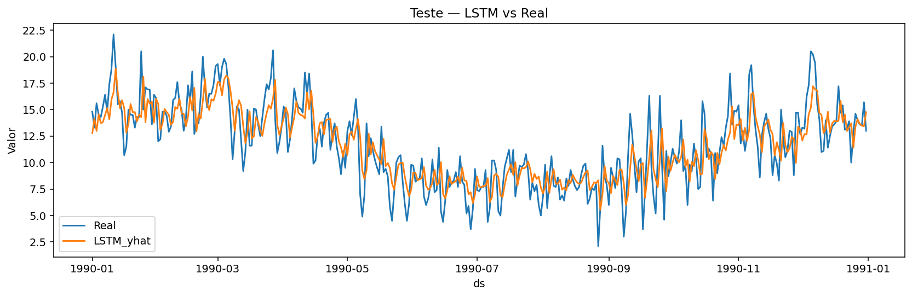
  **O que é:** predições do LSTM (janela 14×1) no mesmo período.
  **Como ler:** modelo seq2seq curto capturando padrões locais de transição; a linha prevista acompanha bem os movimentos de curto e médio prazo.
  **O que observar:** melhora consistente nas métricas (RMSE/MAE) frente ao Prophet neste conjunto, sugerindo que a LSTM captou sinais locais que o Prophet suaviza.

* **Componentes do Prophet (tendência e sazonalidade anual)**
  
  **O que é:** *plots* nativos de componentes (trend/seasonality).
  **Como ler:** confirme se a **trend** está estável e se a **yearly** reflete a forma sazonal esperada (inverno/verão).
  **O que observar:** coerência dos componentes com a EDA (STL e agregação mensal); se a tendência fosse inclinada, rever *priors* de “changepoints”.

* **SARIMAX + Fourier (opcional)**
  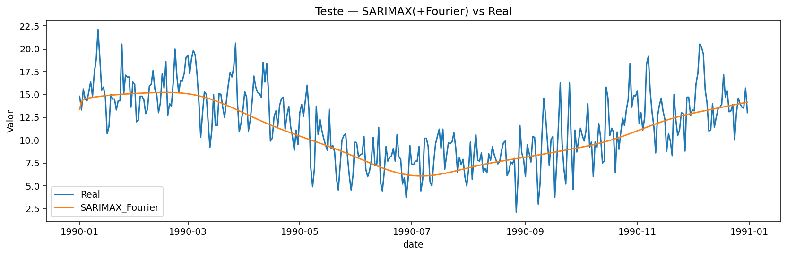
  **O que é:** ARIMA em espaço de estados com **regressores de Fourier** para a sazonalidade anual (K harmônicos).
  **Como ler:** previsão fora da amostra em 1990; a linha prevista deve replicar bem a “onda” anual.
  **O que observar:** escolha de K equilibra viés/variância: K baixo → sazonalidade muito rígida; K alto → risco de sobreajuste.

---

### Diagnósticos

* **Resíduos no teste (Prophet e LSTM)**
  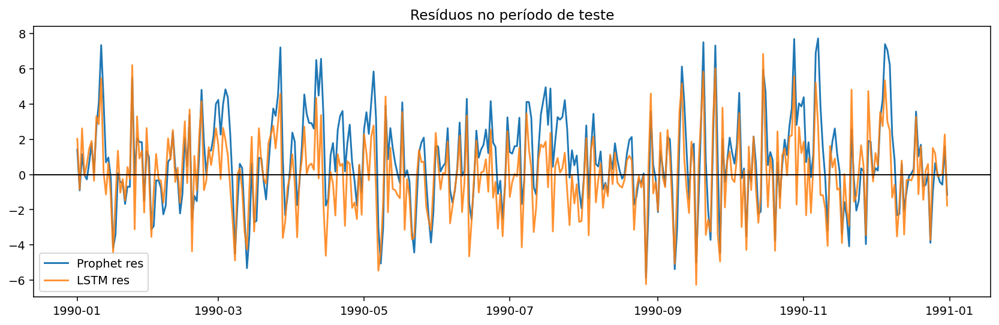
  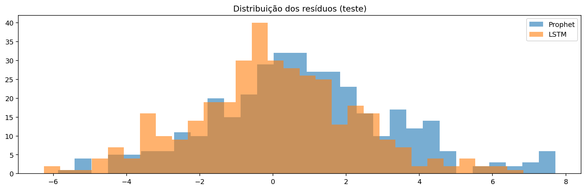
  **O que é:** resíduos = (real − predito) ao longo do tempo e sua distribuição.
  **Como ler:** resíduos devem oscilar em torno de zero, sem **padrões estruturais**; histogramas idealmente próximos de forma simétrica.
  **O que observar:** ausência de tendência/onda forte nos resíduos → menos sinais “não explicados”; caudas gordas indicam dias atípicos (clima extremo).

* **Dispersão y_real vs y_pred**
  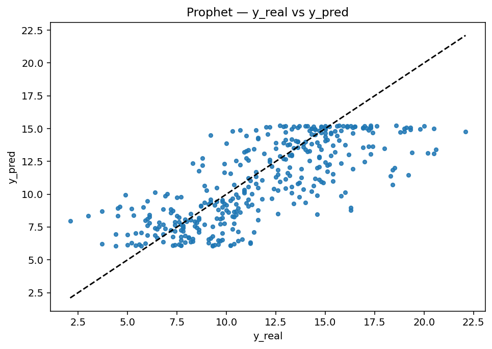
  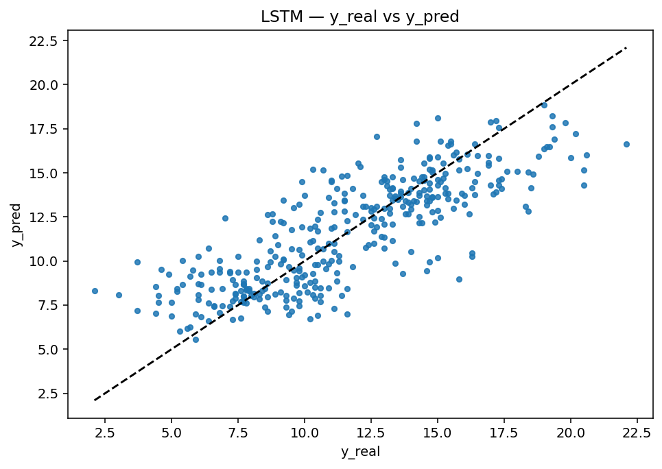
  **O que é:** gráficos de dispersão com a linha **y = x**.
  **Como ler:** pontos próximos da diagonal indicam boa precisão; dispersão vertical é erro.
  **O que observar:** inclinação próxima de 1 e baixa dispersão → melhor ajuste; outliers destacam dias difíceis (penalizam mais o RMSE).

* **Sazonalidade mensal & “spaghetti” por ano**
  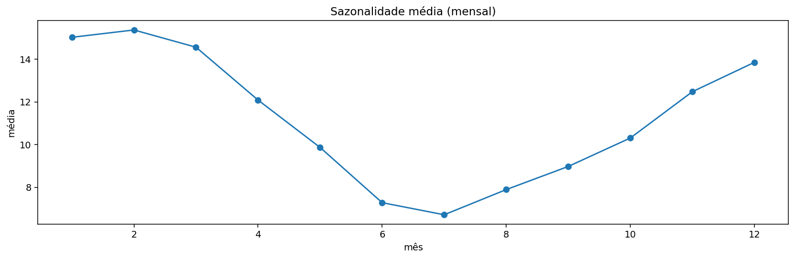
  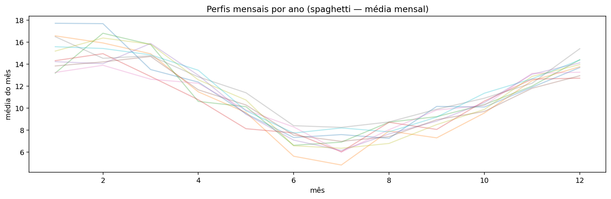
  **O que é:** média por mês (toda a série) e curvas por ano (médias mensais por ano).
  **Como ler:** o gráfico mensal resume o “perfil” típico; o “spaghetti” mostra quanto os anos variam em torno desse perfil.
  **O que observar:** baixa variação entre anos reforça sazonalidade estável; grande variação sugeriria aumentar flexibilidade (ex.: mais harmônicos K no Fourier, `seasonality_prior_scale` maior no Prophet, ou janelas mais longas/arquitetura diferente para LSTM).

---

### Conexão com as métricas

* **Por que RMSE/MAE/MASE aparecem bem nos gráficos?**

  * Linhas previstas que acompanham a sazonalidade e não “perdem o timing” → **MAE** cai (erros médios menores).
  * Menos picos de erro em dias extremos → **RMSE** cai (penaliza quadrático).
  * Superar **Seasonal-Naive** de forma consistente → **MASE < 1**, comprovando ganho real sobre um baseline forte.

> Dica: se notar **padrões** nos resíduos (ex.: onda semanal), adicione regressoras (feriados, efeitos semanais) no Prophet; aumente **K** no Fourier do SARIMAX; ou expanda a janela/arquitetura na LSTM para capturar dependências mais longas.

---

## 🧠 Por que essas escolhas?

- **Prophet**: modelo aditivo interpretable (tendência + sazonalidade). Indicamos `plot_components()` para inspecionar componentes e `changepoint_prior_scale`/`seasonality_prior_scale` para controle de suavidade/complexidade. :contentReference[oaicite:4]{index=4}  
- **LSTM**: boa capacidade de capturar dependências de longo prazo; adequado para séries diárias com estrutura complexa. :contentReference[oaicite:5]{index=5}  
- **SARIMAX+Fourier**: abordagem clássica e eficiente para **sazonalidade longa** (muito comum em dados diários), escolhendo a ordem **K** por critério de informação (AIC/AICc). :contentReference[oaicite:6]{index=6}  
- **Métricas**: **RMSE** (penaliza grandes erros), **MAE** (interpretação direta em °C) e **MASE** (comparável entre séries/métodos; recomendado na literatura). :contentReference[oaicite:7]{index=7}

---

Segue uma **seção de Conclusão** pronta para colar ao final do seu `README.md`. Mantive linguagem direta, com parágrafos bem separados e foco técnico.

---

## ✅ Conclusão

Os resultados mostram que é possível modelar a série de temperaturas mínimas diárias de Melbourne de forma acurada e interpretável. A EDA evidenciou uma sazonalidade anual forte e estável, com nível praticamente constante ao longo dos anos — um cenário que favorece modelos com componente sazonal explícita e também arquiteturas recorrentes que capturam dependências locais. A decomposição STL, os gráficos de média mensal e as funções ACF/PACF foram consistentes entre si, reforçando o caráter cíclico do fenômeno e a ausência de tendências estruturais de longo prazo.

No conjunto de teste (1990), o LSTM apresentou o melhor desempenho médio em RMSE/MAE/MASE, superando as duas linhas de base e o modelo Prophet com *tuning* leve. Essa vantagem aparece em especial em transições mais abruptas, nas quais uma rede recorrente com janela curta tende a responder com maior agilidade. O Prophet, por sua vez, reproduziu com fidelidade a fase da sazonalidade anual e manteve boa estabilidade, oferecendo componentes interpretáveis (tendência e sazonalidade) que ajudam a explicar a dinâmica subjacente. A alternativa com SARIMAX e harmônicos de Fourier capturou bem a sazonalidade de período 365, com estrutura parcimoniosa e custo computacional baixo, se posicionando como opção sólida quando interpretabilidade estatística e leveza de treino são prioritárias.

Os diagnósticos (resíduos no tempo e histogramas) indicaram erros centrados próximos de zero e sem padrões fortes remanescentes, o que é coerente com as métricas observadas. A comparação com o Seasonal-Naive — um *baseline* exigente para séries anuais — confirmou ganho substantivo de acurácia, quantificado pelos deltas de RMSE/MAE. Em validação com origem rolante (H=60), os padrões de desempenho se mantiveram, sugerindo que as conclusões não dependem de um único particionamento temporal.

Em termos práticos, há um equilíbrio natural entre **acurácia** e **explicabilidade**: o LSTM tendeu a liderar nas métricas, enquanto Prophet e SARIMAX+Fourier forneceram componentes e parâmetros diretamente interpretáveis (tendência, sazonalidade, ordem ARIMA, harmônicos). A escolha final depende do objetivo: previsões operacionais com melhor erro absoluto, análises explicativas da sazonalidade, ou pipelines estatísticos mais leves para monitoramento.

Como caminhos de evolução, recomenda-se: (i) incorporar variáveis exógenas (ex.: chuva, radiação, feriados locais) no Prophet e no SARIMAX; (ii) testar janelas/arquiteturas alternativas para o LSTM (camadas empilhadas, *dropout*, *lookback* maior ou *seq2seq* multi-horizonte); (iii) aplicar seleção sistemática do número de harmônicos no Fourier via AICc/BIC; (iv) adotar validação temporal mais extensa (mais dobras ou horizontes variados) em dados atualizados. Essas extensões tendem a consolidar o ganho já observado, sem perder a clareza de interpretação e a reprodutibilidade do fluxo atual.

---

## ▶️ Reprodutibilidade

1. Abra `Notebook_TS_Melbourne_Prophet_LSTM.ipynb` no Google Colab.  
2. Execute todas as células até o fim (ou em sequência).  
3. Rode a célula **“Exportar imagens e ZIP”** para gerar a pasta `images/` e o arquivo `images.zip`.  
4. Suba `images/` (ou `images.zip`) para o repositório (mesmo nível do README).

> **Obs.**: pequenas variações numéricas podem ocorrer por diferenças de versão/bibliotecas e *random seeds*.

---

## 📚 Referências

- **Dataset (Kaggle)** — *Time Series Datasets* → arquivo `daily-minimum-temperatures-in-me.csv`.  
  https://www.kaggle.com/datasets/shenba/time-series-datasets/data?select=daily-minimum-temperatures-in-me.csv

- **Prophet**  
  Quick Start: https://facebook.github.io/prophet/docs/quick_start.html  
  Sazonalidade / feriados / regressores: https://facebook.github.io/prophet/docs/seasonality,_holiday_effects,_and_regressors.html

- **Validação em séries temporais (origem rolante) e acurácia** — Hyndman & Athanasopoulos, *Forecasting: Principles and Practice (FPP3)*  
  Acurácia: https://otexts.com/fpp3/accuracy.html  
  Time series cross-validation: https://otexts.com/fpp3/tscv.html

- **Fourier + ARIMA (sazonalidade longa)** — função `fourier()` do pacote *forecast*  
  https://pkg.robjhyndman.com/forecast/reference/fourier.html

- **MASE** — Hyndman, R.J.; Koehler, A.B. (2006). *International Journal of Forecasting*, 22(4), 679–688.  
  DOI: https://doi.org/10.1016/j.ijforecast.2006.03.001

- **LSTM** — Hochreiter, S.; Schmidhuber, J. (1997). *Long Short-Term Memory*, *Neural Computation*, 9(8), 1735–1780.  
  DOI: https://doi.org/10.1162/neco.1997.9.8.1735

